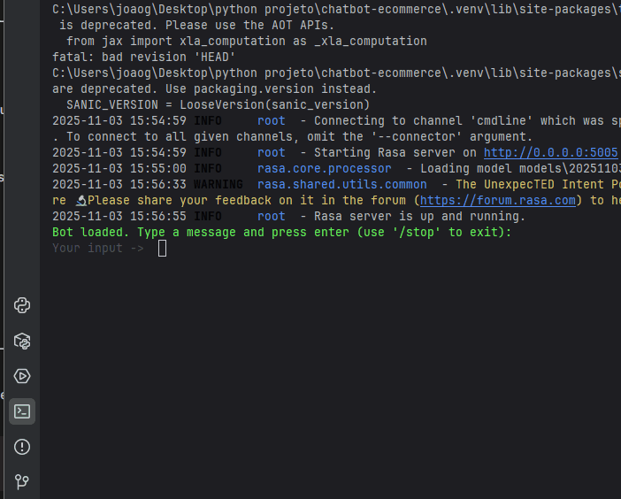

# 🤖 Chatbot de E-commerce com Rasa

Um assistente de IA de código aberto construído com Rasa para simular a interação com um cliente de e-commerce. O chatbot é capaz de responder a perguntas frequentes, recomendar produtos e verificar o status de pedidos.

Este projeto foi desenvolvido como um item de portfólio para demonstrar habilidades em desenvolvimento de software, inteligência artificial e boas práticas de engenharia.

---

### 🎬 Demonstração

  

---

### ✨ Funcionalidades Principais

*   **🧠 Processamento de Linguagem Natural (NLU):** Entende a intenção do usuário, mesmo com variações de frases.
*   **🗣️ Gerenciamento de Diálogo:** Mantém o contexto da conversa para interações mais fluidas.
*   **🛍️ Recomendações de Produtos:** Sugere produtos com base na categoria informada pelo usuário.
*   **📦 Consulta de Pedidos:** Verifica o status de um pedido através de um ID (simulado).
*   **❓ Respostas a FAQs:** Responde a perguntas comuns sobre frete e formas de pagamento.
*   **🛠️ Ações Customizadas:** Utiliza código Python para executar lógicas de negócio, como consultar um banco de dados (simulado).

---

### 🛠️ Tecnologias Utilizadas

*   **Framework de IA:** [Rasa Open Source](https://rasa.com/)
*   **Linguagem:** Python 3.8+
*   **Gerenciamento de Dependências:** Pip & Venv

---

### 📂 Estrutura do Projeto

O projeto segue uma estrutura de pastas limpa e organizada, promovendo a manutenibilidade e escalabilidade.

